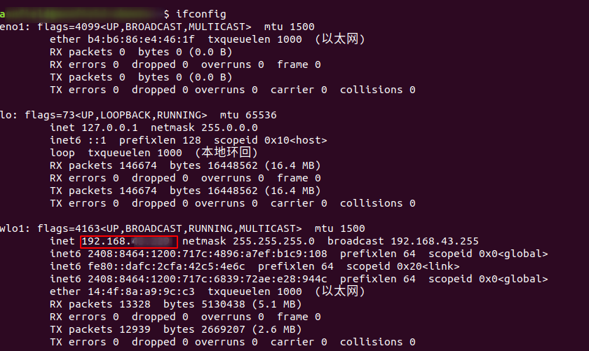

### communication

#### 通过SSH的方式实现PC和ROS机器人之间的通信

**第一步，使PC和小车处于同一局域网，并获取各自的IP**

在终端通过`ifconfig`命令查看ip。



**第二步，修改目录/etc/hosts文件**

```sh
sudo gedit /etc/hosts
```

在PC端添加小车的ip和hostname,这里的hostname最好通过命令`hostname`查看

```
ip   hostname
```

同样的，在小车端添加PC的ip和hostname

**最后双端可以通过SSH命令互相访问**

```shell
ssh username@<ip>
```

听说使用putty可以不处于同一局域网，有待验证

#### 主从机设置

​		在上面设置好hosts的基础上(不设置hosts的话能实现多机查看话题列表，但不能进行消息的多机通信),在从机端，一般是PC端，设置：

```bash
echo "export ROS_HOSTNAME=本机ip" >> ~/.bashrc
echo "export ROS_MASTER_URI=主机ip" >> ~/.bashrc
```

设置完以后，就只能用主机运行`roscore`了，从机在不需要进行多机通信的时候需要在.bashrc文件中注释掉这两行，不然无法正常运行

**测试**

主机使用：

```shell
roscore
rosrun turtlesim turtlesim_node
```

从机使用：

```shell
rosrun turtlesim turtle_teleop_key
```

在从机端通过键盘控制主机端的乌龟移动

**SSH和ROS的本身的多机通信是有着区别的，建议在实际使用时(如建图时)PC控制ROS小车结合使用，此外，通过vnc、scp、ftp等手段也可实现PC对ROS小车的远程控制，文件传输**


