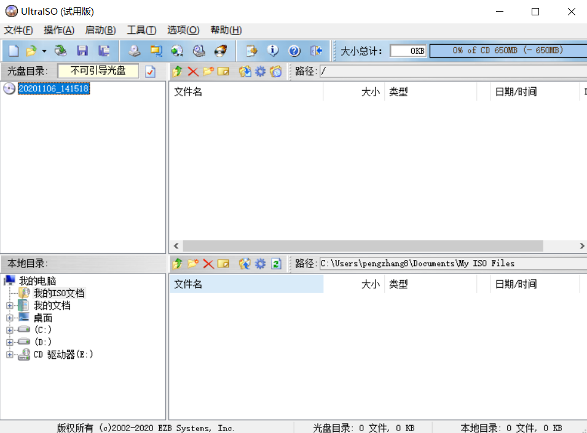
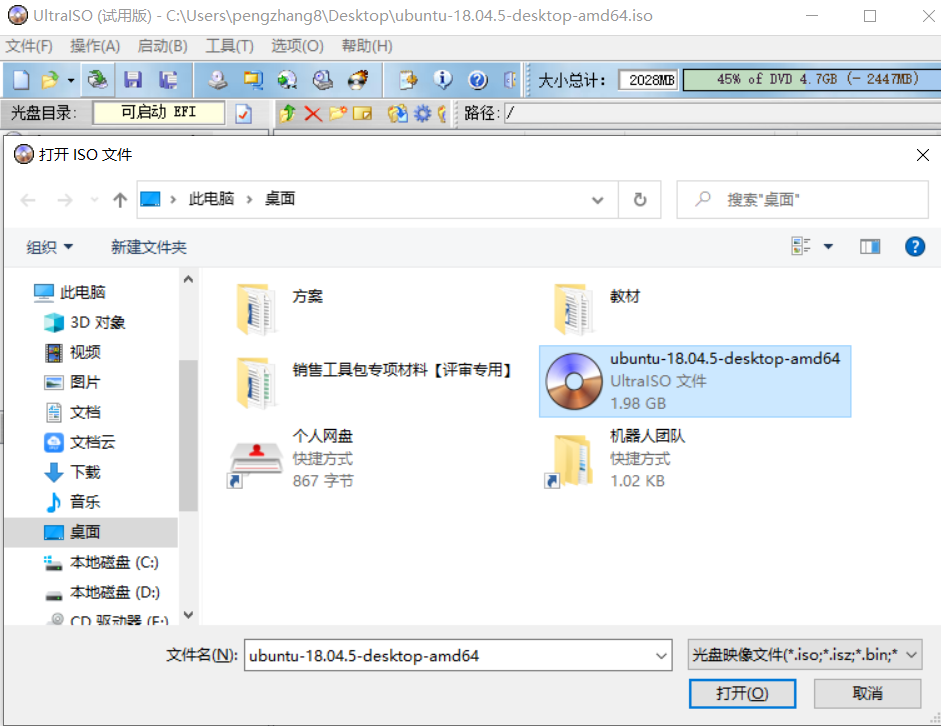
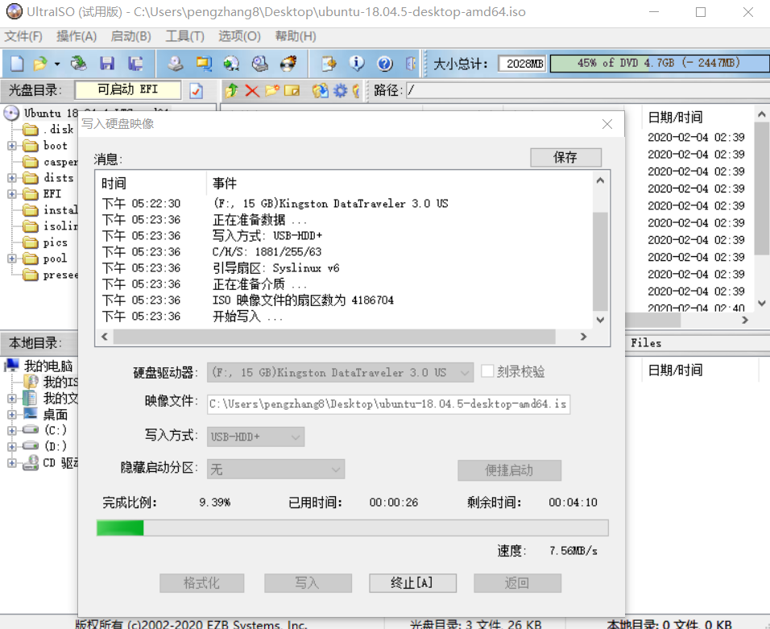
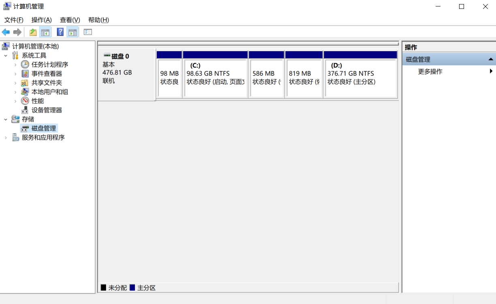
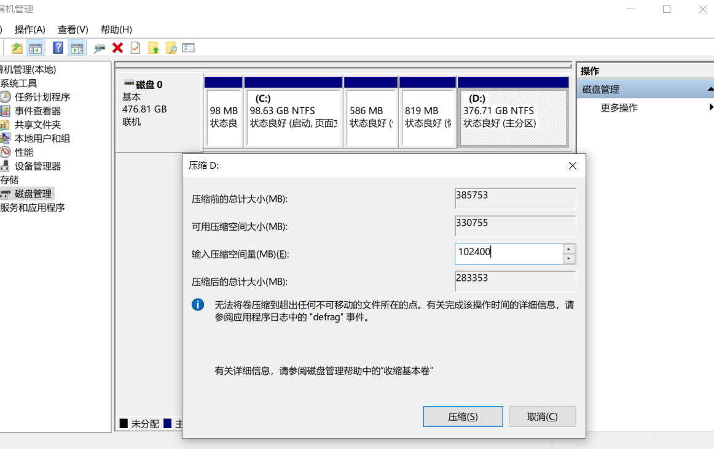
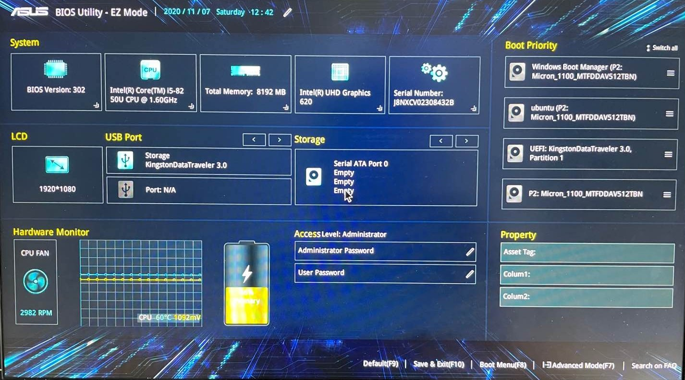
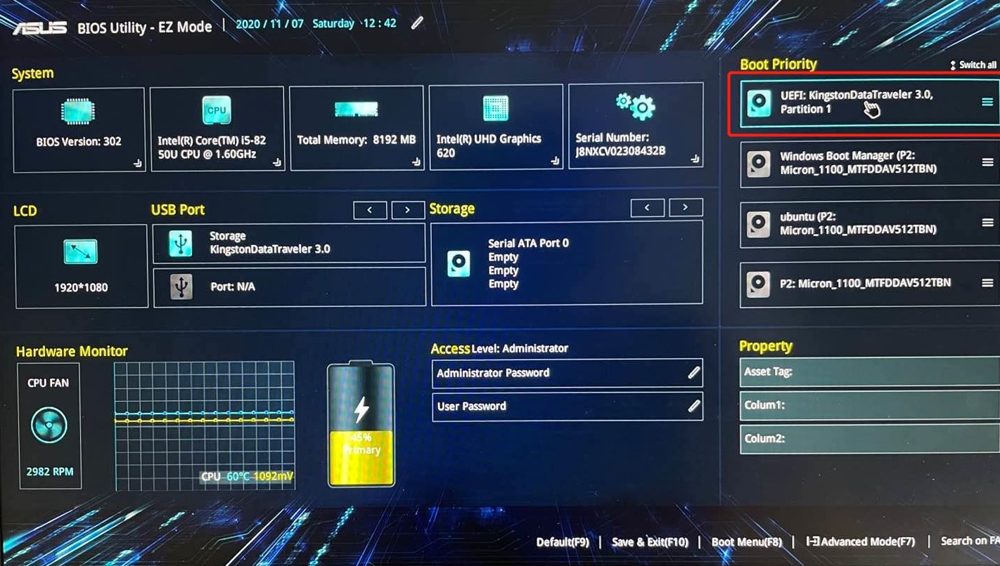
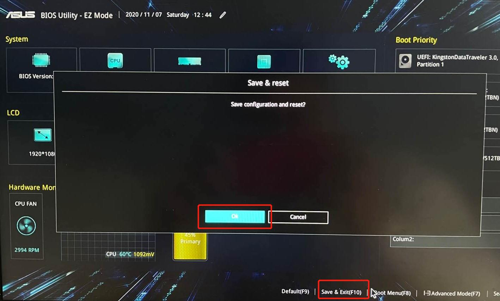
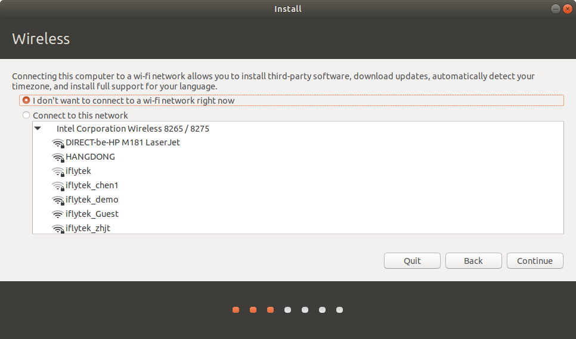
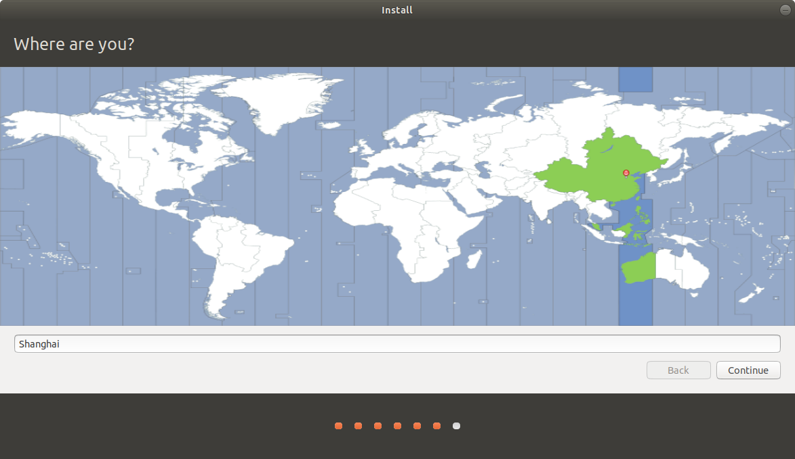

# 一月九日培训内容

## 培训内容介绍

- 完成Ubuntu18.04和ROS melodic的安装

- 熟悉Ubuntu操作系统的界面

- 熟悉一些简单的Linux操作

- 完成小乌龟的仿真测试

## 详细培训内容

### Ubuntu系统的安装

​        ROS是一个机器人操作平台，本次培训和比赛设计的是ROS的一个版本，即`melodic`，该版本是运行在linux系统上的，因此我们选用`Ubuntu`这个Linux系统的发行版作为安装ROS的操作系统。查看讯飞机器人学院（http://www.iflyros.com/courseInfo?id=81）的具体的操作如下：

  安装之前要做一些准备工作，如硬件检查、分区准备、分区方法选择。
#### 1. **获取Ubuntu系统安装包**

  如前所述这里选择Ubuntu 18.04 LTS桌面版，（制作本教程时使用的下载链接为：http://releases.ubuntu.com/18.04/ubuntu-18.04.5-desktop-amd64.iso），下载下来的ISO镜像文件为ubuntu-18.04.5-desktop-amd64.iso。
#### 2. **准备硬件**

  硬件最低要求：至少2GHz的双核处理器，4GB内存，25GB可用硬盘空间以及DVD光驱或USB端口，用于安装程序介质，确保计算机能够连接访问Internet,以便安装过程中在线下载软件包。
#### 3. **制作系统盘**

  首先下载用于制作系统盘的软件UltraISO（官网地址：https://cn.ultraiso.net/），下载完成后按照安装导引完成软件安装并打开，软件界面如下图所示：



  单击左上角工具栏中的文件->打开，在文件目录中选中刚刚下载的Ubuntu镜像文件，如下图所示：



  然后单击工具栏中的启动->写入硬盘映像，然后选择自己准备好的用来做系统盘的U盘，我们这里使用的是一个Kingston的16G大小的U盘，然后单击写入，进入制作过程，如下图所示:



  至此，系统盘制作完成。
#### 4. **电脑端配置**

  鉴于大部分读者只有一台电脑且希望保留Windows系统的情况，我们接下来的教程是教大家如何安装双系统，由于不同的电脑安装的方式会有所差异，所以本节仅供参考，安装过程中注意备份windows数据和配置，以免发生“不测”。

  以华硕的ASUSPRO为例，该笔记本操作系统默认为Windows 10，我们右击此电脑，点击管理，然后双击左侧的存储->磁盘管理，会看到如下界面：



  这里可以看到这台笔记电脑的磁盘使用情况，因为D盘的容量比较大，所以我们需要把D盘压缩出一块存储空间给Ubuntu系统使用，（读者在压缩的时候综合自己电脑中的存储情况来决策），操作步骤如下所示：首先右击D盘->压缩卷，这里会提示你输入压缩空间量（MB），我们在这里选择给Ubuntu系统预留100G（也就是102400M）的容量。



  点击压缩后，我们可以看到磁盘中出现了一块100G的未分配空间，这部分空间也就是我们将要安装Ubuntu系统的区域。
#### 5. **开始安装**

  这一部不同的电脑也有可能是不同的，我们还是以这台华硕ASUSPRO为例，首先电脑关机，然后按一下电脑开机键，屏幕刚一亮就要按一下F2，这时候电脑就进入了BIOS页面，如下图所示：



  这时候我们可以看到右侧有个Boot Priority是用来控制Boot启动顺序的，这时候我们要把我们前面制作的系统盘的优先级拉高（注意前一步开机的时候请确保制作的系统盘已经插好，否则这一步看不到系统盘的），也就是鼠标点击我们那个Kingston的设备拖到最上面，如下图所示：



  设置完成后，根据图片下方的提示，需要按F10保存并退出，点击OK就进入了U盘启动的过程。



  然后稍后会进入如下页面，通过键盘上下键选择Install Ubuntu后点击确认键。


  随后就会进入Ubuntu系统的安装导引，首先看到的就是语言的选择，咱们这里选择英文，如下图所示（不习惯英文界面的同学也可以选择中文）


  下一步是网络的选择，这里可以选择连接你的无线网络或者选择不连接网络。



  接下来可以选择正常安装或者最小化安装，区别主要在于正常安装的话会帮助用户预装很多的办公和娱乐相关的应用软件。


  接下来一步是选择系统安装的位置，这里千万记住不要不小心擦除了。


  接下来一步是选择时区，这里大家可以根据自己所在区域选择时区，如下图所示：



  最后一步就进入了用户名、PC名以及密码的设置界面，这部分大家根据自己的习惯进行设置即可。


  至此Ubuntu系统就已完成完整安装。

### ROS的安装

​       ROS的安装可以参考roswiki网站（http://wiki.ros.org/cn）上面给出的教程:http://wiki.ros.org/cn/melodic/Installation/Ubuntu

​       也可以参考群里给出的pdf文档进行安装

### 简单的linux操作说明

​       在讯飞的机器人学院里面有对Ubuntu系统和Linux命令的说明与讲解（http://www.iflyros.com/courseInfo?id=81），本此培训以此为基准进行讲解。

### 小乌龟仿真测试

​      一般测试ROS系统是否安装正确最简单的方式就是利用一个简单的功能包进行测试，也即是通过用键盘控制小乌龟运动即可。键盘控制的命令在安装ROS的pdf里面已经给出，这里复述一下：

1. 打开新终端，输入命令：

   ```roscore```

 2. 打开第二个终端，输入：

 ```
 rosrun turtlesim turtlesim_node
 ```

 3. 打开第三个终端，输入：

 ```
 rosrun turtlesim turtle_teleop_key
 ```
4. 最后结果如下所示


## 本次培训任务


