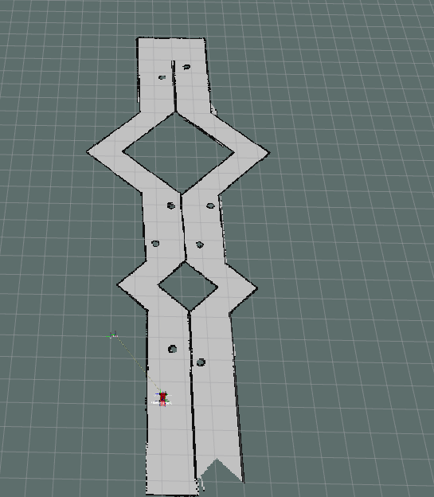
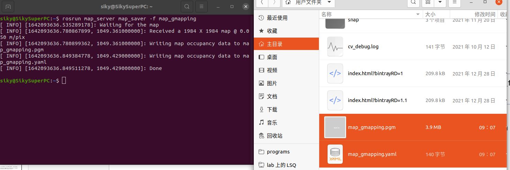
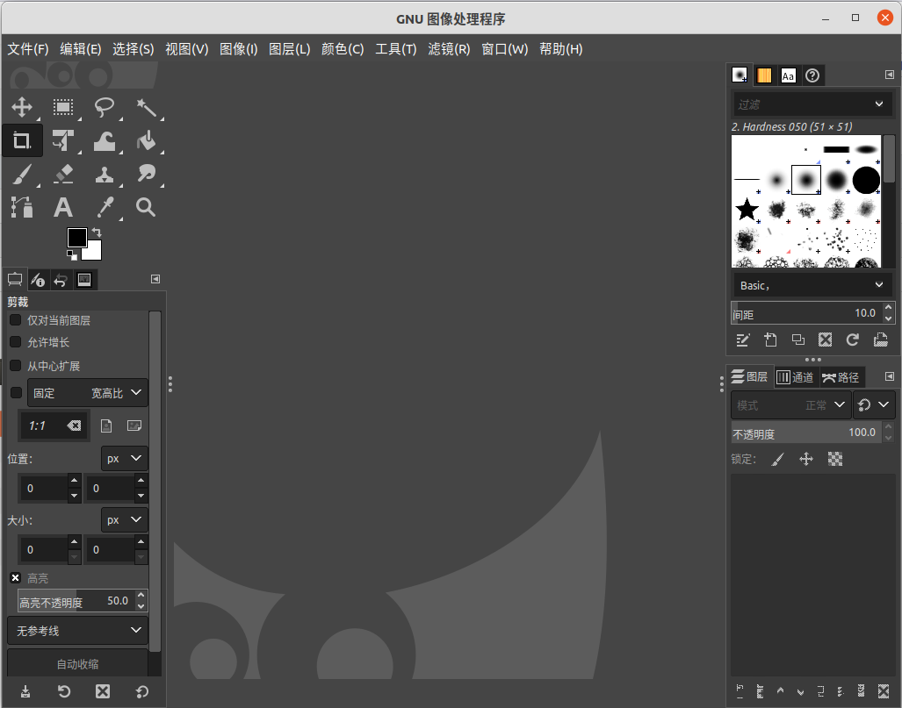
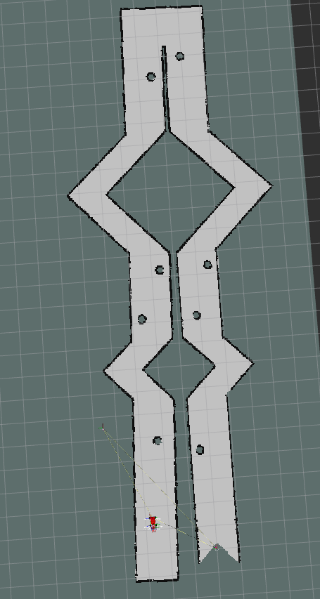

# SLAM 建图

## Gmapping 建图

Gmapping 算法是目前基于激光雷达和里程计方案里面比较可靠和成熟的一个算法，它基于粒子滤波，采用 RBPF 的方法效果稳定，许多基于 ROS 的机器人都跑的是gmapping_slam。这个软件包位于 ros-perception 组织中的 slam_gmapping 仓库中。 其中的 slam_gmapping 是一个 metapackage，它依赖了 gmapping，而算法具体实现都在 gmapping软件包中，该软件包中slam_gmapping 程序就是我们在 ROS 中运行的 SLAM 节点。

gmapping 的作用是根据激光雷达和里程计（Odometry）的信息，对环境地图进行构建，并且对自身状态进行估计。因此它得输入应当包括激光雷达和里程计的数据，而输出应当有自身位置和地图。

- Gmapping 介绍

- 启动 Gmapping
  
    ```bash
    cannnot launch type of ... gmapping
    sudo apt install ros-melodic-gmapping
    ```
    
    `roslaunch racecar_gazebo racecar_runway.launch` 启动gazebo仿真环境
    
    `roslaunch racecar_gazebo slam_gmapping.launch`启动Gmapping
    
- `lanch`文件介绍

- 建图结果：
  
    
    
- 使用map_server保存地图：`rosrun map_server map_saver -f your_map_name`



包括一个`.pgm`文件和一个`.yaml`文件

```bash
sudo apt install ros-melodic-map-server
siky@SikySuperPC:~$ cat map_gmapping.yaml 
image: map_gmapping.pgm
resolution: 0.050000
origin: [-50.000000, -50.000000, 0.000000]
negate: 0
occupied_thresh: 0.65
free_thresh: 0.196
```

- 使用`GIMP`编辑`.gpm`文件
    - 安装`GIMP`
    
    `sudo apt install gimp`
    
    **注意保存的时候 选择：文件→导出为→选择gpm格式**
    
    
    

## hector建图

Hector SLAM 算法不同于前面两种算法，Hector 只需要激光雷达数据，而不需要里程计数据。这种算法比较适合手持式的激光雷达，并且对激光雷达的扫描频率有一定要求。Hector 算法的效果不如 Gmapping、Karto，因为它仅用到激光雷达信息。这样建图与定位的依据就不如多传感器结合的效果好。但 Hector 适合手持移动或者本身就没有里程计的机器人使用

```bash
sudo apt install ros-melodic-hector-slam
rosrun hector_mapping hector_mapping
```

```xml
<!--hector_mapping.launch-->
<launch>
    <node pkg="hector_mapping" type="hector_mapping" name="hector_mapping" output="screen">
      <param name="base_frame" value="base_link"/> <!--机器人底盘坐标系基框架，附带在移动底盘的框架，原点-->
      <param name="odom_frame" value="odom"/> <!--里程计坐标系里程计框架，附带在里程计的框架-->
      <param name="map_frame" value="map"/> <!--地图坐标系地图框架，附带在地图上的框架-->
      <param name="map_resolution" value="0.05"/> 
      <param name="map_start_x" value="0.1"/>
      <param name="map_start_y" value="0.1"/>
      <param name="map_pub_period" value="0.1"/>
    </node>
    <node pkg="rviz" type="rviz" name="rviz" args="-d $(find racecar_gazebo)/config/new_gmapping.rviz"/>
</launch>
```



## **Cartographer建图**

[Cartographer ROS Integration - Cartographer ROS documentation](https://google-cartographer-ros.readthedocs.io/en/latest/index.html)

[Cartographer install and demo](http://community.bwbot.org/topic/620/cartographer-install-and-demo)

安装必要的工具

```bash
# ROS Noetic
sudo apt-get update
sudo apt-get install -y python3-wstool python3-rosdep ninja-build stow 
# ROS Melodic
sudo apt-get update
sudo apt-get install -y python-wstool python-rosdep ninja-build stow
```

下载源代码

```bash
mkdir catkin_ws
cd catkin_ws
wstool init src
wstool merge -t src https://raw.githubusercontent.com/cartographer-project/cartographer_ros/master/cartographer_ros.rosinstall
wstool update -t src
```

安装依赖

```bash
sudo rosdep init
rosdep update
rosdep install --from-paths src --ignore-src --rosdistro=${ROS_DISTRO} -y
```

安装`abecil-cpp`

```bash
src/cartographer/scripts/install_abseil.sh
```

编译安装

```bash
catkin_make_isolated --install --use-ninja
```

运行demo程序

下载对德意志博物馆2D建图 Demo

```bash
wget -P ~/Downloads https://storage.googleapis.com/cartographer-public-data/bags/backpack_2d/cartographer_paper_deutsches_museum.bag
source install_isolated/setup.bash
roslaunch cartographer_ros demo_backpack_2d.launch bag_filename:=${HOME}/Downloads/cartographer_paper_deutsches_museum.bag
```

```bash

```

## 任务
1. 自行编写`.launch`文件，通过该`launch`启动hector建图节点（或gmapping）与rivz节点
2. 保存通过hector（或gmapping）包建立的地图
3. 使用GIMP编辑地图并导出